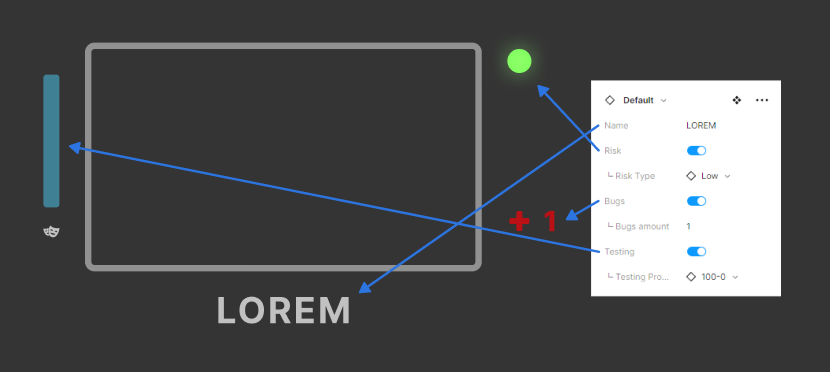

# Application-Map

## Overview

This project is a visual representation of an application's task and page flow, designed with Figma. It includes different pages and states of pages of the application, each with an associated risk level and a progress bar indicating the degree of automation. This tool is ideal for having a bird’s eye view over the automation status for an application, it is also ideal for presenting the status to stakeholders and non-technical team members.

## Structure

#### Application Map

A map for the application with screenshots of different pages can be built using components. Each page can and should be connected with lines, making the flow of pages visible.

#### Risk Association

Each page has a risk associated with it, indicated by a colored circle on the top right corner of the page component. The colors correspond to different levels of risk, from Low to High.

#### Automation Progress

Each page has a progress bar that shows how much of the automation has been done. This allows for easy tracking of automation progress throughout the application.

#### New Bugs

Each page can have a bug counter that shows new bugs found. This can be toggled on or off.

## Metrics Summary

#### Progress Panel


The Progress panel provides a quick overview of the automation status for each section of the application. It is divided into three categories:
- **Completed**: Indicated by a check symbol, it shows the tasks that have been fully automated.
- **In Progress**: Marked with an arrow symbol, represents the tasks currently undergoing automation.

- **Not Started**: Marked with an 'x' symbol, it signifies the tasks yet to be started on automation.
 

#### Risk Panel

The Risk panel gives an insight into risk associated with each page of the application. It is divided into three categories:

- **High Risk**: Indicated by red circles.
- **Medium Risk**: Indicated by orange circles.
- **Low Risk**: Indicated by green circles.


## Components
The Figma file contains easily modifiable components for the pages and metrics. These components are designed to be flexible and adaptable to suit different annotations for pages.

 

A variety of symbols used throughout the map. These icons are used as subcomponents to build other components.

Represent the progress bars used to indicate the degree of automation on each page. Five variants showing different progressions are available: 0%, 25%, 50%, 75%, 100%.


The Pages component consists of layouts that represent different pages and states of the application. These layouts can be customized to accurately depict the actual pages in the application. 

By selecting different properties for these components in Figma, you can easily adapt the map to reflect changes in the pages, risks, and automation progress.

## Properties

The Pages component includes several properties that can be modified to suit the needs of the application. These properties are:


#### Name
This is a text property that represents the name of the page.
#### Risk
This is a toggle property that indicates whether a page has associated risks.


#### Risk Type

A property that represents the level of risk associated with a page. It can be set to Low, Medium, or High.
#### Bugs
A toggle property that indicates whether a page has any new bugs.


#### Bugs Amount
A text property that can be used to specify the number of new bugs found on a page.
#### Testing
This is a toggle property that indicates whether a page has undergone testing.


#### Testing Progress
This property represents the progress of testing or automation on a page. Inheriting variants from the Bar component it can be set to 0%, 25%, 50%, 75%, 100%.

## Example Flows

Two example flows from the app Notion.so are included in the project. These serve as a practical example of how the application map, risk association, and automation progress features come together.
